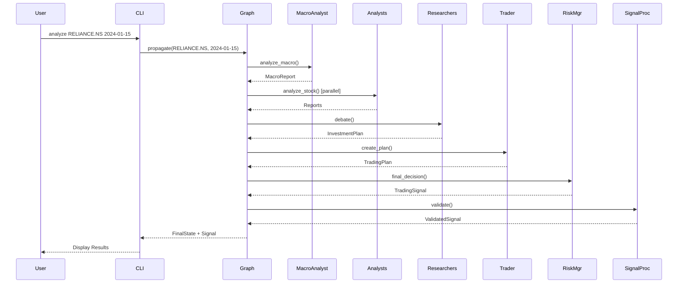
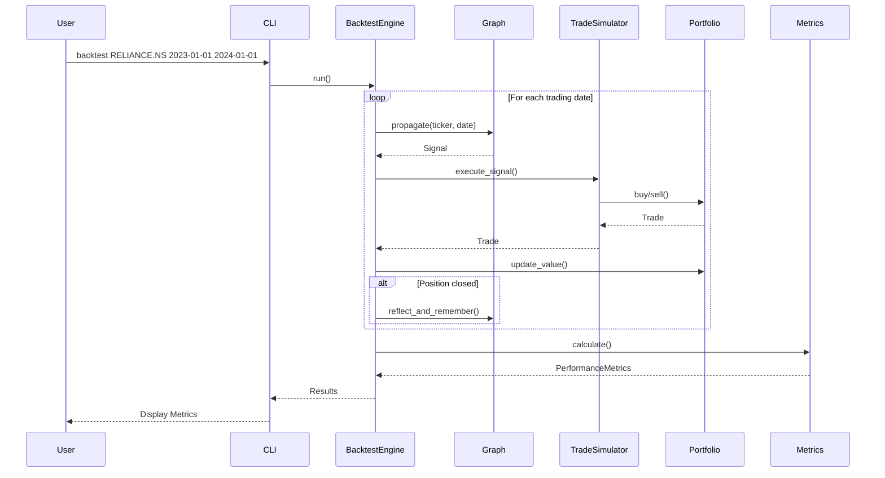
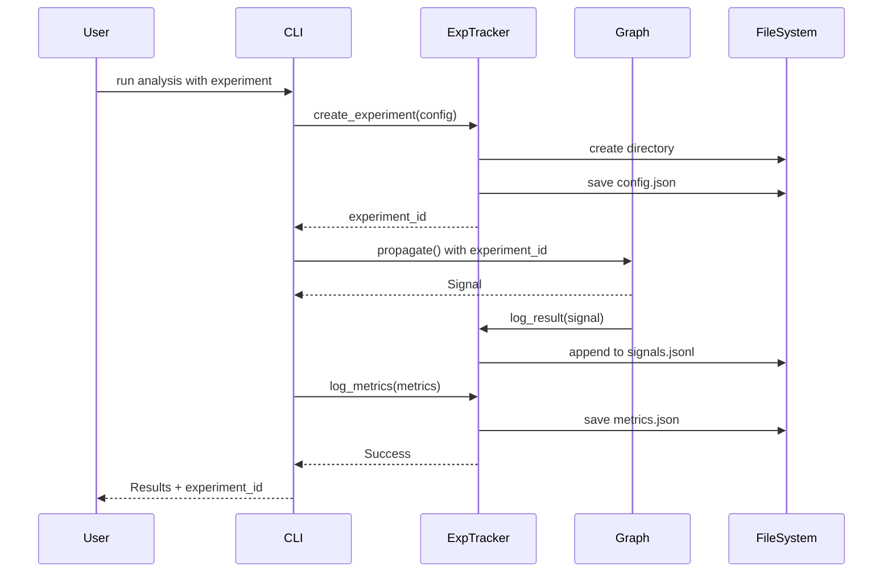

# Design Document: Chanana Quant System Upgrade

## Overview

### Purpose

This design document provides comprehensive technical specifications for upgrading the Chanana Quant trading system from a research prototype into a production-grade trading research system. The upgrade preserves the existing LangGraph multi-agent architecture while adding critical capabilities for systematic validation, Indian market specialization, and production deployment.

### System Context

Chanana Quant is an AI-native hedge fund architecture for Indian markets that uses LangGraph to orchestrate specialized AI agents for market analysis, investment research, trading decisions, and risk management. The current system analyzes individual stocks through a multi-agent workflow but lacks structured output, backtesting infrastructure, and Indian market specialization.

### Design Scope

This design covers six phases of upgrades:

1. **Phase 1: Foundation** - Structured signal output and Indian market ticker support
2. **Phase 2: Macro Awareness** - Indian market context (NIFTY50, India VIX, FII/DII flows)
3. **Phase 3: Backtesting** - Historical simulation and performance metrics
4. **Phase 4: Experiments** - Experiment tracking and comparison framework
5. **Phase 5: Portfolio** - Multi-stock portfolio management with risk controls
6. **Phase 6: Dashboard** - Web-based monitoring and visualization interface

### Key Design Principles

1. **Preserve Architecture**: Extend the existing LangGraph system rather than replace it
2. **Backward Compatibility**: All new features are opt-in; existing functionality remains unchanged
3. **Composition Over Modification**: Add new modules that compose with existing components
4. **Incremental Deployment**: Each phase delivers working functionality independently
5. **Indian Market Focus**: Specialize for NSE/BSE markets with India-specific indicators


## Architecture

### Current System Architecture

The existing Chanana Quant system follows a multi-agent workflow orchestrated by LangGraph:

```
User Input (ticker, date)
    ↓
[ANALYST TEAM] - Parallel Analysis
    ├─ Market Analyst → Technical indicators
    ├─ Social Media Analyst → Sentiment analysis
    ├─ News Analyst → News and insider transactions
    └─ Fundamentals Analyst → Financial statements
    ↓
[RESEARCH TEAM] - Debate-Based Synthesis
    ├─ Bull Researcher → Investment case
    ├─ Bear Researcher → Counter-arguments
    └─ Research Manager → Synthesized plan
    ↓
[TRADER AGENT] - Trading Decision
    └─ Trader → Trading plan
    ↓
[RISK MANAGEMENT TEAM] - Risk Assessment
    ├─ Aggressive Analyst → High-risk perspective
    ├─ Conservative Analyst → Risk-averse perspective
    ├─ Neutral Analyst → Balanced perspective
    └─ Risk Manager → Final decision (BUY/SELL/HOLD)
    ↓
Output: Free-form text decision
```

Key architectural components:
- **LangGraph Orchestration**: State machine managing agent workflow
- **Agent State**: Shared state accumulating reports from each agent
- **Memory System**: BM25-based retrieval for learning from past decisions
- **Data Abstraction**: Vendor-agnostic data fetching with fallback support
- **LLM Abstraction**: Multi-provider support (OpenAI, Anthropic, Google, xAI, Ollama)


### Upgraded System Architecture

The upgraded system adds new layers while preserving the core workflow:

```mermaid
graph TB
    subgraph "Phase 1: Foundation"
        A[Structured Signal Processor] --> B[Signal Validator]
        C[Indian Ticker Normalizer] --> D[Market Calendar]
    end
    
    subgraph "Phase 2: Macro Context"
        E[Macro Analyst] --> F[NIFTY50 Analysis]
        E --> G[India VIX Analysis]
        E --> H[FII/DII Flow Analysis]
        E --> I[Sector Classification]
    end
    
    subgraph "Phase 3: Backtesting"
        J[Backtesting Engine] --> K[Portfolio Tracker]
        J --> L[Trade Simulator]
        J --> M[Performance Metrics]
    end
    
    subgraph "Phase 4: Experiments"
        N[Experiment Tracker] --> O[Config Manager]
        N --> P[Result Logger]
        N --> Q[Comparison Engine]
    end
    
    subgraph "Phase 5: Portfolio"
        R[Portfolio Manager] --> S[Position Sizing]
        R --> T[Risk Controls]
        R --> U[Rebalancing Logic]
    end
    
    subgraph "Phase 6: Dashboard"
        V[Streamlit Dashboard] --> W[Live Analysis UI]
        V --> X[Backtesting UI]
        V --> Y[Experiments UI]
        V --> Z[Portfolio UI]
    end
    
    subgraph "Core System (Preserved)"
        AA[LangGraph Workflow]
        AB[Agent State]
        AC[Memory System]
        AD[Data Layer]
    end
    
    E --> AA
    A --> AA
    C --> AD
    J --> AA
    N --> AA
    R --> AA
    V --> AA

```



### Integration Strategy

The upgrade follows a composition-based integration strategy:

1. **Signal Processing Layer**: Wraps existing Risk Manager output with structured extraction
2. **Macro Context Layer**: Adds optional Macro Analyst node before existing analysts
3. **Backtesting Layer**: Orchestrates multiple calls to existing `propagate()` method
4. **Experiment Layer**: Wraps graph execution with logging and configuration management
5. **Portfolio Layer**: Aggregates multiple single-stock analyses with portfolio constraints
6. **Dashboard Layer**: Provides UI on top of all existing functionality

This approach ensures:
- Zero breaking changes to existing code
- Gradual feature adoption
- Independent testing of each phase
- Rollback capability if issues arise


## Components and Interfaces

### Phase 1: Foundation Components

#### 1.1 TradingSignal Schema

**Location**: `chanana_quant/agents/utils/agent_states.py`

**Purpose**: Structured representation of trading decisions

**Schema Definition**:
```python
from pydantic import BaseModel, Field
from typing import Literal, Optional
from datetime import datetime

class TradingSignal(BaseModel):
    """Structured trading signal output."""
    
    # Core decision
    action: Literal["BUY", "SELL", "HOLD"] = Field(
        description="Trading action recommendation"
    )
    confidence: float = Field(
        ge=0.0, le=1.0,
        description="Confidence score between 0 and 1"
    )
    
    # Position sizing
    position_size_pct: float = Field(
        ge=0.0, le=100.0,
        description="Recommended position size as % of portfolio"
    )
    
    # Risk management
    stop_loss_pct: Optional[float] = Field(
        default=None,
        description="Stop loss as % below entry price"
    )
    take_profit_pct: Optional[float] = Field(
        default=None,
        description="Take profit as % above entry price"
    )
    holding_period_days: Optional[int] = Field(
        default=None,
        description="Expected holding period in days"
    )
    
    # Reasoning
    primary_reason: str = Field(
        description="Main reason for the decision"
    )
    supporting_factors: list[str] = Field(
        default_factory=list,
        description="Additional supporting factors"
    )
    risk_factors: list[str] = Field(
        default_factory=list,
        description="Identified risk factors"
    )
    
    # Metadata
    timestamp: datetime = Field(
        default_factory=datetime.now,
        description="Signal generation timestamp"
    )
    ticker: str = Field(
        description="Stock ticker symbol"
    )
    analysis_date: str = Field(
        description="Date of analysis (YYYY-MM-DD)"
    )
```

**Integration Points**:
- Risk Manager agent outputs this schema
- Signal Processor extracts from text as fallback
- Backtesting Engine consumes for trade simulation
- Experiment Tracker logs for analysis


#### 1.2 Signal Processor

**Location**: `chanana_quant/graph/signal_processing.py`

**Purpose**: Extract structured signals from agent output with validation

**Class Interface**:
```python
class SignalProcessor:
    """Processes and validates trading signals."""
    
    def __init__(self, quick_thinking_llm):
        """Initialize with LLM for fallback extraction."""
        self.quick_thinking_llm = quick_thinking_llm
        self.parser = PydanticOutputParser(pydantic_object=TradingSignal)
    
    def process_signal(
        self, 
        full_signal: str, 
        ticker: str, 
        analysis_date: str
    ) -> TradingSignal:
        """Extract structured signal from text decision.
        
        Args:
            full_signal: Free-form text decision from Risk Manager
            ticker: Stock ticker symbol
            analysis_date: Analysis date (YYYY-MM-DD)
            
        Returns:
            Structured TradingSignal object
            
        Raises:
            ValueError: If signal extraction fails completely
        """
        
    def validate_signal(
        self, 
        signal: TradingSignal
    ) -> tuple[bool, list[str]]:
        """Validate signal for consistency and reasonableness.
        
        Args:
            signal: TradingSignal to validate
            
        Returns:
            (is_valid, error_messages) tuple
        """
```

**Validation Rules**:
1. Action consistency: BUY requires position_size_pct > 0, HOLD requires 0%
2. Confidence alignment: HOLD with confidence > 0.7 triggers warning
3. Stop loss reasonableness: > 20% triggers warning
4. Take profit logic: Should exceed stop loss
5. Risk/reward ratio: Take profit should be at least 1.5x stop loss (warning)

**Fallback Strategy**:
1. Try structured output from Risk Manager directly
2. If unavailable, use LLM to extract from text
3. If extraction fails, return default HOLD signal with low confidence
4. Log all fallback occurrences for monitoring


#### 1.3 Indian Market Utilities

**Location**: `chanana_quant/dataflows/indian_market_utils.py`

**Purpose**: Handle Indian market-specific ticker formats, holidays, and trading hours

**Module Interface**:
```python
def normalize_indian_ticker(symbol: str) -> str:
    """Convert Indian ticker to yfinance format.
    
    Args:
        symbol: Stock symbol (e.g., "RELIANCE", "TCS", "RELIANCE.NS")
        
    Returns:
        Normalized ticker with .NS suffix (e.g., "RELIANCE.NS")
        
    Examples:
        >>> normalize_indian_ticker("RELIANCE")
        "RELIANCE.NS"
        >>> normalize_indian_ticker("RELIANCE.NS")
        "RELIANCE.NS"
        >>> normalize_indian_ticker("RELIANCE.BO")
        "RELIANCE.BO"
    """

def is_indian_ticker(symbol: str) -> bool:
    """Check if ticker is Indian market format.
    
    Args:
        symbol: Stock symbol
        
    Returns:
        True if ticker ends with .NS or .BO
    """

def is_indian_market_open(date: datetime) -> bool:
    """Check if Indian market is open on given date.
    
    Args:
        date: Date to check
        
    Returns:
        True if market is open (weekday, not holiday)
    """

def get_next_trading_day(date: datetime) -> datetime:
    """Get next Indian trading day after given date.
    
    Args:
        date: Starting date
        
    Returns:
        Next valid trading day
    """

def get_indian_sector(symbol: str) -> str:
    """Get sector classification for Indian stock.
    
    Args:
        symbol: Stock ticker (with or without .NS/.BO)
        
    Returns:
        Sector name (Energy, IT, Banking, Telecom, Pharma, Auto, FMCG, Unknown)
    """

def get_sector_peers(symbol: str, n: int = 5) -> list[str]:
    """Get peer stocks in same sector.
    
    Args:
        symbol: Stock ticker
        n: Number of peers to return
        
    Returns:
        List of peer ticker symbols
    """
```

**Data Structures**:
```python
# Indian market holidays for 2024-2025
INDIAN_MARKET_HOLIDAYS = [
    "2024-01-26",  # Republic Day
    "2024-03-08",  # Maha Shivaratri
    "2024-03-25",  # Holi
    "2024-03-29",  # Good Friday
    "2024-04-11",  # Id-Ul-Fitr
    "2024-04-17",  # Ram Navami
    "2024-04-21",  # Mahavir Jayanti
    "2024-05-01",  # Maharashtra Day
    "2024-05-23",  # Buddha Purnima
    "2024-06-17",  # Bakri Id
    "2024-07-17",  # Muharram
    "2024-08-15",  # Independence Day
    "2024-08-26",  # Janmashtami
    "2024-10-02",  # Gandhi Jayanti
    "2024-10-12",  # Dussehra
    "2024-11-01",  # Diwali
    "2024-11-15",  # Guru Nanak Jayanti
    "2024-12-25",  # Christmas
]

# Sector mapping for major Indian stocks
INDIAN_SECTOR_MAPPING = {
    "RELIANCE": "Energy",
    "TCS": "IT",
    "INFY": "IT",
    "HDFCBANK": "Banking",
    "ICICIBANK": "Banking",
    "HINDUNILVR": "FMCG",
    "ITC": "FMCG",
    "BHARTIARTL": "Telecom",
    "SBIN": "Banking",
    "BAJFINANCE": "Banking",
    "MARUTI": "Auto",
    "TATAMOTORS": "Auto",
    "SUNPHARMA": "Pharma",
    "DRREDDY": "Pharma",
    "ONGC": "Energy",
    "NTPC": "Energy",
    "POWERGRID": "Energy",
    "COALINDIA": "Energy",
    # ... extended mapping for NIFTY50 and beyond
}
```


### Phase 2: Macro Context Components

#### 2.1 Macro Analyst Agent

**Location**: `chanana_quant/agents/analysts/macro_analyst.py`

**Purpose**: Analyze market-level indicators and provide macro context to all downstream agents

**Agent Interface**:
```python
def create_macro_analyst(llm, tools):
    """Create macro analyst agent for market-level analysis.
    
    Args:
        llm: Language model for analysis
        tools: List of macro data tools
        
    Returns:
        LangGraph agent node function
    """
    
    def macro_analyst_node(state: AgentState) -> dict:
        """Analyze macro market conditions.
        
        Generates macro_report containing:
        - NIFTY50 trend and performance
        - India VIX volatility regime
        - FII/DII institutional flows
        - Sector performance and rotation signals
        - Stock vs index relative strength
        
        Returns:
            Updated state with macro_report field
        """
```

**Macro Report Schema**:
```python
class MacroReport(BaseModel):
    """Macro market analysis report."""
    
    # NIFTY50 Analysis
    nifty50_trend: Literal["bullish", "bearish", "sideways"]
    nifty50_change_1d: float  # Percentage
    nifty50_change_1w: float  # Percentage
    nifty50_current_level: float
    
    # Volatility Analysis
    india_vix_current: float
    india_vix_percentile: float  # Historical percentile (0-100)
    volatility_regime: Literal["low", "medium", "high"]
    vix_trend: Literal["rising", "falling", "stable"]
    
    # Institutional Flows
    fii_net_flow: Optional[float]  # Crores
    dii_net_flow: Optional[float]  # Crores
    fii_trend: Optional[Literal["buying", "selling", "neutral"]]
    dii_trend: Optional[Literal["buying", "selling", "neutral"]]
    institutional_sentiment: Literal["bullish", "bearish", "neutral"]
    
    # Sector Analysis
    sector_performance: dict[str, float]  # Sector -> % change
    top_performing_sectors: list[str]
    worst_performing_sectors: list[str]
    
    # Stock Context
    stock_sector: str
    stock_vs_nifty: Literal["outperforming", "underperforming", "inline"]
    sector_momentum: Literal["strong", "weak", "neutral"]
    
    # Metadata
    analysis_date: str
    timestamp: datetime
```


#### 2.2 Macro Data Tools

**Location**: `chanana_quant/agents/utils/macro_data_tools.py`

**Purpose**: Fetch macro market data for analysis

**Tool Definitions**:
```python
@tool
def get_nifty50_data(start_date: str, end_date: str) -> dict:
    """Fetch NIFTY50 index data.
    
    Args:
        start_date: Start date (YYYY-MM-DD)
        end_date: End date (YYYY-MM-DD)
        
    Returns:
        Dictionary with OHLCV data and calculated metrics
    """

@tool
def get_india_vix_data(start_date: str, end_date: str) -> dict:
    """Fetch India VIX volatility index data.
    
    Args:
        start_date: Start date (YYYY-MM-DD)
        end_date: End date (YYYY-MM-DD)
        
    Returns:
        Dictionary with VIX values and regime classification
    """

@tool
def get_sectoral_indices(start_date: str, end_date: str) -> dict:
    """Fetch sectoral index performance.
    
    Args:
        start_date: Start date (YYYY-MM-DD)
        end_date: End date (YYYY-MM-DD)
        
    Returns:
        Dictionary mapping sector names to performance metrics
    """

@tool
def get_fii_dii_flows(date: str) -> dict:
    """Fetch FII/DII flow data for given date.
    
    Args:
        date: Date (YYYY-MM-DD)
        
    Returns:
        Dictionary with FII and DII net flows in crores
    """
```

**Data Sources**:
- NIFTY50: yfinance ticker `^NSEI`
- India VIX: yfinance ticker `^INDIAVIX`
- Sectoral Indices: yfinance tickers `^NSEBANK`, `^CNXIT`, `^CNXPHARMA`, `^CNXAUTO`
- FII/DII: NSE India website or MoneyControl API (with fallback to proxy indicators)


### Phase 3: Backtesting Components

#### 3.1 Backtesting Engine

**Location**: `chanana_quant/backtesting/engine.py`

**Purpose**: Orchestrate historical simulation of trading decisions

**Class Interface**:
```python
class BacktestEngine:
    """Runs agent decisions on historical data."""
    
    def __init__(
        self, 
        graph: ChananaQuantGraph, 
        initial_capital: float = 100000
    ):
        """Initialize backtesting engine.
        
        Args:
            graph: Configured trading graph instance
            initial_capital: Starting portfolio value
        """
        self.graph = graph
        self.portfolio = Portfolio(initial_capital)
        self.simulator = TradeSimulator()
        self.metrics = PerformanceMetrics()
        self.results = []
    
    def run(
        self,
        ticker: str,
        start_date: str,
        end_date: str,
        rebalance_frequency: str = "daily"
    ) -> dict:
        """Run backtest over date range.
        
        Args:
            ticker: Stock ticker to trade
            start_date: Start date (YYYY-MM-DD)
            end_date: End date (YYYY-MM-DD)
            rebalance_frequency: Analysis frequency (daily/weekly)
            
        Returns:
            Dictionary containing:
            - results: List of daily results
            - metrics: Performance metrics
            - portfolio: Final portfolio state
        """
    
    def _generate_trading_dates(
        self,
        start_date: str,
        end_date: str,
        frequency: str
    ) -> list[str]:
        """Generate list of trading dates based on frequency.
        
        Args:
            start_date: Start date
            end_date: End date
            frequency: daily or weekly
            
        Returns:
            List of trading dates (YYYY-MM-DD)
        """
```

**Execution Flow**:
1. Generate trading dates based on frequency and market calendar
2. For each date:
   - Call `graph.propagate(ticker, date)` to get signal
   - Simulate trade execution via TradeSimulator
   - Update portfolio state
   - Record results
   - If position closed, call `graph.reflect_and_remember()` with returns
3. Calculate final performance metrics
4. Return comprehensive results


#### 3.2 Portfolio Tracker

**Location**: `chanana_quant/backtesting/portfolio.py`

**Purpose**: Track portfolio state during backtesting

**Data Models**:
```python
@dataclass
class Position:
    """Represents a stock position."""
    ticker: str
    quantity: int
    entry_price: float
    entry_date: str
    stop_loss: Optional[float] = None
    take_profit: Optional[float] = None
    exit_price: Optional[float] = None
    exit_date: Optional[str] = None
    
    @property
    def cost_basis(self) -> float:
        """Total cost of position."""
        return self.quantity * self.entry_price
    
    def current_value(self, current_price: float) -> float:
        """Current market value."""
        return self.quantity * current_price
    
    def pnl(self, current_price: float) -> float:
        """Profit/loss in currency."""
        return self.current_value(current_price) - self.cost_basis
    
    def pnl_pct(self, current_price: float) -> float:
        """Profit/loss as percentage."""
        return (self.pnl(current_price) / self.cost_basis) * 100
    
    @property
    def is_closed(self) -> bool:
        """Check if position is closed."""
        return self.exit_price is not None

class Portfolio:
    """Tracks portfolio state during backtesting."""
    
    def __init__(self, initial_capital: float):
        self.initial_capital = initial_capital
        self.cash = initial_capital
        self.positions: dict[str, Position] = {}
        self.closed_positions: list[Position] = []
        self.trades: list[dict] = []
        self.value_history: list[dict] = []
    
    @property
    def total_value(self) -> float:
        """Current portfolio value (cash + positions)."""
    
    def buy(
        self, 
        ticker: str, 
        quantity: int, 
        price: float, 
        date: str,
        stop_loss: Optional[float] = None,
        take_profit: Optional[float] = None
    ):
        """Execute buy order."""
    
    def sell(self, ticker: str, price: float, date: str):
        """Execute sell order."""
    
    def update_value(self, date: str):
        """Update portfolio value for given date."""
    
    def to_dict(self) -> dict:
        """Convert portfolio state to dictionary."""
```


#### 3.3 Trade Simulator

**Location**: `chanana_quant/backtesting/simulator.py`

**Purpose**: Simulate realistic trade execution

**Class Interface**:
```python
class TradeSimulator:
    """Simulates trade execution based on signals."""
    
    def execute_signal(
        self,
        signal: TradingSignal,
        portfolio: Portfolio,
        date: str
    ) -> Optional[dict]:
        """Execute trade based on signal.
        
        Args:
            signal: Structured trading signal
            portfolio: Current portfolio state
            date: Execution date
            
        Returns:
            Trade details or None if no trade executed
        """
    
    def _get_execution_price(
        self, 
        ticker: str, 
        date: str
    ) -> Optional[float]:
        """Get execution price (next day's open).
        
        Args:
            ticker: Stock ticker
            date: Signal date
            
        Returns:
            Next trading day's open price
        """
    
    def _check_stop_loss(
        self,
        position: Position,
        current_price: float
    ) -> bool:
        """Check if stop loss is triggered."""
    
    def _check_take_profit(
        self,
        position: Position,
        current_price: float
    ) -> bool:
        """Check if take profit is triggered."""
```

**Execution Logic**:

1. **BUY Signal**:
   - Calculate position size: `portfolio.total_value * signal.position_size_pct / 100`
   - Get execution price: next trading day's open
   - Calculate quantity: `position_size / execution_price` (rounded down)
   - Check sufficient cash, adjust quantity if needed
   - Execute buy order with stop loss and take profit levels

2. **SELL Signal**:
   - Check if position exists
   - Get execution price: next trading day's open
   - Execute sell order
   - Record P&L

3. **HOLD Signal**:
   - Check existing positions for stop loss / take profit triggers
   - Execute automatic exits if triggered
   - Otherwise, maintain position

**Slippage and Fees** (Optional):
- Configurable slippage percentage (default: 0.1%)
- Configurable transaction fees (default: 0.05%)
- Applied to all trades for realistic simulation


#### 3.4 Performance Metrics Calculator

**Location**: `chanana_quant/backtesting/metrics.py`

**Purpose**: Calculate comprehensive performance metrics

**Class Interface**:
```python
class PerformanceMetrics:
    """Calculate backtesting performance metrics."""
    
    def calculate(
        self, 
        results: list[dict], 
        portfolio: Portfolio
    ) -> dict:
        """Calculate comprehensive performance metrics.
        
        Args:
            results: List of daily backtest results
            portfolio: Final portfolio state
            
        Returns:
            Dictionary of performance metrics
        """
    
    def _calculate_returns(self, values: list[float]) -> np.ndarray:
        """Calculate daily returns from portfolio values."""
    
    def _calculate_sharpe_ratio(
        self, 
        returns: np.ndarray,
        risk_free_rate: float = 0.05
    ) -> float:
        """Calculate annualized Sharpe ratio."""
    
    def _calculate_max_drawdown(self, values: list[float]) -> float:
        """Calculate maximum drawdown."""
    
    def _calculate_cagr(
        self,
        initial_value: float,
        final_value: float,
        days: int
    ) -> float:
        """Calculate compound annual growth rate."""
```

**Metrics Calculated**:

1. **Return Metrics**:
   - Total Return: `(final_value - initial_capital) / initial_capital`
   - CAGR: Annualized return over backtest period
   - Daily/Weekly/Monthly returns distribution

2. **Risk Metrics**:
   - Sharpe Ratio: Risk-adjusted return (assuming 5% risk-free rate, 252 trading days)
   - Max Drawdown: Maximum peak-to-trough decline
   - Volatility: Standard deviation of returns (annualized)
   - Downside Deviation: Volatility of negative returns only

3. **Trade Metrics**:
   - Win Rate: Percentage of profitable trades
   - Average Win: Average profit percentage of winning trades
   - Average Loss: Average loss percentage of losing trades
   - Profit Factor: Total profits / Total losses
   - Total Trades: Number of closed positions
   - Average Holding Period: Average days per trade

4. **Portfolio Metrics**:
   - Final Value: Ending portfolio value
   - Peak Value: Maximum portfolio value reached
   - Average Cash Allocation: Average cash percentage
   - Maximum Position Size: Largest single position as % of portfolio


### Phase 4: Experiment Tracking Components

#### 4.1 Experiment Configuration

**Location**: `chanana_quant/experiments/config.py`

**Purpose**: Define and manage experiment configurations

**Data Model**:
```python
@dataclass
class ExperimentConfig:
    """Configuration for a single experiment."""
    
    # Experiment metadata
    experiment_id: str
    name: str
    description: str
    created_at: str
    
    # System configuration
    llm_provider: str
    deep_think_llm: str
    quick_think_llm: str
    max_debate_rounds: int
    max_risk_discuss_rounds: int
    
    # Analyst selection
    selected_analysts: list[str]
    
    # Data configuration
    data_vendors: dict[str, str]
    
    # Backtesting parameters (if applicable)
    ticker: Optional[str] = None
    start_date: Optional[str] = None
    end_date: Optional[str] = None
    initial_capital: Optional[float] = None
    rebalance_frequency: Optional[str] = None
    
    # Custom parameters
    custom_params: dict = field(default_factory=dict)
    
    def to_dict(self) -> dict:
        """Convert to dictionary."""
        return asdict(self)
    
    def to_json(self) -> str:
        """Serialize to JSON."""
        return json.dumps(self.to_dict(), indent=2)
    
    @classmethod
    def from_dict(cls, data: dict) -> 'ExperimentConfig':
        """Create from dictionary."""
        return cls(**data)
    
    @classmethod
    def generate_id(cls) -> str:
        """Generate unique experiment ID."""
        return f"exp_{datetime.now().strftime('%Y%m%d_%H%M%S')}"
```

**Configuration Validation**:
- Validate LLM provider is supported
- Validate analysts exist in system
- Validate date formats and ranges
- Validate numeric parameters are within bounds


#### 4.2 Experiment Tracker

**Location**: `chanana_quant/experiments/tracker.py`

**Purpose**: Log and retrieve experiment results

**Class Interface**:
```python
class ExperimentTracker:
    """Tracks experiments and their results."""
    
    def __init__(self, experiments_dir: str = "./experiments"):
        """Initialize tracker with storage directory."""
        self.experiments_dir = Path(experiments_dir)
        self.experiments_dir.mkdir(parents=True, exist_ok=True)
    
    def create_experiment(self, config: ExperimentConfig) -> str:
        """Create new experiment and return ID.
        
        Creates directory structure:
        experiments/{experiment_id}/
            config.json
            signals.jsonl
            metrics.json
            logs.txt
        """
    
    def log_result(
        self,
        experiment_id: str,
        result_type: str,
        data: dict
    ):
        """Log experiment result to JSONL file.
        
        Args:
            experiment_id: Experiment identifier
            result_type: Type of result (signals, trades, states)
            data: Result data to log
        """
    
    def log_metrics(self, experiment_id: str, metrics: dict):
        """Log performance metrics to JSON file."""
    
    def get_experiment(self, experiment_id: str) -> Optional[ExperimentConfig]:
        """Load experiment configuration."""
    
    def list_experiments(self) -> list[ExperimentConfig]:
        """List all experiments sorted by creation date."""
    
    def get_results(
        self,
        experiment_id: str,
        result_type: str = "signals"
    ) -> list[dict]:
        """Load experiment results from JSONL file."""
    
    def delete_experiment(self, experiment_id: str):
        """Delete experiment and all its data."""
```

**Storage Format**:
- **config.json**: Experiment configuration (single JSON object)
- **signals.jsonl**: Trading signals (one JSON object per line)
- **metrics.json**: Performance metrics (single JSON object)
- **logs.txt**: Execution logs (text file)

**JSONL Format Benefits**:
- Append-only writes (efficient for streaming results)
- Easy to parse line-by-line
- Handles large result sets without loading entire file
- Compatible with standard tools (jq, pandas)


#### 4.3 Experiment Comparison Engine

**Location**: `chanana_quant/experiments/comparison.py`

**Purpose**: Compare multiple experiments and generate reports

**Class Interface**:
```python
class ExperimentComparison:
    """Compare multiple experiments."""
    
    def __init__(self, tracker: ExperimentTracker):
        self.tracker = tracker
    
    def compare_metrics(
        self, 
        experiment_ids: list[str]
    ) -> pd.DataFrame:
        """Compare metrics across experiments.
        
        Returns DataFrame with columns:
        - experiment_id, name, llm_provider, analysts
        - All performance metrics
        """
    
    def compare_signals(
        self,
        experiment_ids: list[str]
    ) -> pd.DataFrame:
        """Compare signals across experiments.
        
        Returns DataFrame with all signals tagged by experiment_id.
        """
    
    def generate_comparison_report(
        self,
        experiment_ids: list[str]
    ) -> str:
        """Generate markdown comparison report.
        
        Report includes:
        - Performance metrics table
        - Best performers for each metric
        - Configuration differences
        - Signal distribution analysis
        """
    
    def plot_performance_comparison(
        self,
        experiment_ids: list[str],
        metric: str = "sharpe_ratio"
    ) -> Figure:
        """Generate performance comparison chart."""
    
    def analyze_signal_agreement(
        self,
        experiment_ids: list[str]
    ) -> dict:
        """Analyze agreement between experiments.
        
        Returns:
        - Agreement rate (% of dates with same action)
        - Disagreement breakdown (BUY vs SELL, etc.)
        - Confidence correlation
        """
```

**Comparison Report Format**:
```markdown
# Experiment Comparison Report

Generated: 2024-01-15 10:30:00

## Experiments Compared
- exp_20240115_093000: GPT-4 with all analysts
- exp_20240115_100000: Claude-3 with all analysts
- exp_20240115_103000: GPT-4 with market+fundamentals only

## Performance Metrics

| Experiment | Sharpe | CAGR | Max DD | Win Rate | Profit Factor |
|------------|--------|------|--------|----------|---------------|
| exp_...000 | 1.45   | 18.2%| -12.3% | 62.5%    | 1.85          |
| exp_...000 | 1.32   | 15.8%| -15.1% | 58.3%    | 1.72          |
| exp_...000 | 1.28   | 14.5%| -13.8% | 60.0%    | 1.68          |

## Best Performers
- Highest Sharpe Ratio: exp_20240115_093000 (1.45)
- Highest CAGR: exp_20240115_093000 (18.2%)
- Lowest Drawdown: exp_20240115_093000 (-12.3%)
- Highest Win Rate: exp_20240115_093000 (62.5%)

## Configuration Differences
...
```


### Phase 5: Portfolio Management Components

#### 5.1 Portfolio Manager

**Location**: `chanana_quant/portfolio/manager.py`

**Purpose**: Manage multi-stock portfolios with risk controls

**Class Interface**:
```python
class PortfolioManager:
    """Manages multi-stock portfolio with risk controls."""
    
    def __init__(
        self,
        graph: ChananaQuantGraph,
        initial_capital: float = 100000,
        max_position_size_pct: float = 20.0,
        max_sector_exposure_pct: float = 40.0,
        max_total_exposure_pct: float = 100.0,
        position_sizing_method: str = "signal"
    ):
        """Initialize portfolio manager.
        
        Args:
            graph: Trading graph instance
            initial_capital: Starting capital
            max_position_size_pct: Max single position size
            max_sector_exposure_pct: Max sector concentration
            max_total_exposure_pct: Max total equity exposure
            position_sizing_method: signal, kelly, risk_based, equal_weight
        """
    
    def analyze_stock(
        self,
        ticker: str,
        date: str
    ) -> TradingSignal:
        """Run analysis for a single stock."""
    
    def analyze_portfolio(
        self,
        tickers: list[str],
        date: str
    ) -> dict[str, TradingSignal]:
        """Run analysis for multiple stocks."""
    
    def execute_signals(
        self,
        signals: dict[str, TradingSignal],
        date: str
    ) -> list[dict]:
        """Execute trades based on signals with risk controls.
        
        Returns list of executed trades.
        """
    
    def check_risk_limits(
        self,
        ticker: str,
        signal: TradingSignal
    ) -> tuple[bool, list[str]]:
        """Check if trade violates risk limits.
        
        Returns (is_allowed, violation_messages).
        """
    
    def rebalance_portfolio(
        self,
        target_allocations: dict[str, float],
        date: str
    ) -> list[dict]:
        """Rebalance portfolio to target allocations."""
    
    def get_portfolio_summary(self) -> dict:
        """Get current portfolio state and metrics."""
```


#### 5.2 Position Sizing Algorithms

**Location**: `chanana_quant/portfolio/position_sizing.py`

**Purpose**: Calculate optimal position sizes

**Module Interface**:
```python
def calculate_signal_based_size(
    signal: TradingSignal,
    portfolio_value: float
) -> float:
    """Use position size from signal directly.
    
    Args:
        signal: Trading signal with position_size_pct
        portfolio_value: Current portfolio value
        
    Returns:
        Position size in currency
    """

def calculate_kelly_size(
    win_rate: float,
    avg_win: float,
    avg_loss: float,
    portfolio_value: float,
    max_kelly_fraction: float = 0.25
) -> float:
    """Calculate position size using Kelly Criterion.
    
    Formula: f = (p * b - q) / b
    where:
        f = fraction of capital to bet
        p = probability of win
        q = probability of loss (1 - p)
        b = ratio of win to loss
    
    Args:
        win_rate: Historical win rate (0-1)
        avg_win: Average win percentage
        avg_loss: Average loss percentage (positive)
        portfolio_value: Current portfolio value
        max_kelly_fraction: Cap on Kelly fraction (default 0.25)
        
    Returns:
        Position size in currency
    """

def calculate_risk_based_size(
    volatility: float,
    target_risk_pct: float,
    portfolio_value: float
) -> float:
    """Calculate position size based on volatility.
    
    Inverse volatility weighting: lower volatility = larger position.
    
    Args:
        volatility: Stock volatility (annualized std dev)
        target_risk_pct: Target portfolio risk percentage
        portfolio_value: Current portfolio value
        
    Returns:
        Position size in currency
    """

def calculate_equal_weight_size(
    num_positions: int,
    portfolio_value: float
) -> float:
    """Calculate equal-weight position size.
    
    Args:
        num_positions: Number of positions in portfolio
        portfolio_value: Current portfolio value
        
    Returns:
        Position size in currency
    """
```

**Position Sizing Strategy Selection**:
- **signal**: Use position_size_pct from TradingSignal (default)
- **kelly**: Kelly Criterion based on historical performance
- **risk_based**: Inverse volatility weighting
- **equal_weight**: Equal allocation across all positions


#### 5.3 Risk Controls

**Location**: `chanana_quant/portfolio/risk_controls.py`

**Purpose**: Enforce portfolio-level risk limits

**Module Interface**:
```python
class RiskControls:
    """Portfolio-level risk limit enforcement."""
    
    def __init__(
        self,
        max_position_size_pct: float = 20.0,
        max_sector_exposure_pct: float = 40.0,
        max_total_exposure_pct: float = 100.0,
        max_correlation: float = 0.7
    ):
        """Initialize risk controls with limits."""
    
    def check_position_size_limit(
        self,
        ticker: str,
        position_value: float,
        portfolio_value: float
    ) -> tuple[bool, Optional[str]]:
        """Check if position size exceeds limit.
        
        Returns (is_valid, error_message).
        """
    
    def check_sector_exposure_limit(
        self,
        ticker: str,
        position_value: float,
        current_positions: dict[str, Position],
        portfolio_value: float
    ) -> tuple[bool, Optional[str]]:
        """Check if adding position violates sector limit.
        
        Returns (is_valid, error_message).
        """
    
    def check_total_exposure_limit(
        self,
        position_value: float,
        current_positions: dict[str, Position],
        portfolio_value: float
    ) -> tuple[bool, Optional[str]]:
        """Check if total exposure exceeds limit.
        
        Returns (is_valid, error_message).
        """
    
    def check_correlation_limit(
        self,
        ticker: str,
        current_positions: dict[str, Position],
        lookback_days: int = 60
    ) -> tuple[bool, Optional[str]]:
        """Check if new position is too correlated with existing.
        
        Returns (is_valid, error_message).
        """
    
    def adjust_position_size(
        self,
        ticker: str,
        requested_size: float,
        current_positions: dict[str, Position],
        portfolio_value: float
    ) -> float:
        """Adjust position size to comply with all limits.
        
        Returns maximum allowed position size.
        """
```

**Risk Limit Hierarchy**:
1. **Position Size Limit**: No single position > 20% of portfolio
2. **Sector Exposure Limit**: No sector > 40% of portfolio
3. **Total Exposure Limit**: Total equity < 100% (allows cash buffer)
4. **Correlation Limit**: Avoid highly correlated positions (optional)

**Violation Handling**:
- Position size violations: Reduce size to maximum allowed
- Sector violations: Reject trade entirely
- Total exposure violations: Reject trade entirely
- Log all violations for monitoring


## Data Models

### Core Data Structures

#### TradingSignal
```python
class TradingSignal(BaseModel):
    action: Literal["BUY", "SELL", "HOLD"]
    confidence: float  # 0.0 to 1.0
    position_size_pct: float  # 0.0 to 100.0
    stop_loss_pct: Optional[float]
    take_profit_pct: Optional[float]
    holding_period_days: Optional[int]
    primary_reason: str
    supporting_factors: list[str]
    risk_factors: list[str]
    timestamp: datetime
    ticker: str
    analysis_date: str
```

#### Position
```python
@dataclass
class Position:
    ticker: str
    quantity: int
    entry_price: float
    entry_date: str
    stop_loss: Optional[float]
    take_profit: Optional[float]
    exit_price: Optional[float]
    exit_date: Optional[str]
```

#### MacroReport
```python
class MacroReport(BaseModel):
    nifty50_trend: Literal["bullish", "bearish", "sideways"]
    nifty50_change_1d: float
    nifty50_change_1w: float
    india_vix_current: float
    volatility_regime: Literal["low", "medium", "high"]
    fii_net_flow: Optional[float]
    dii_net_flow: Optional[float]
    institutional_sentiment: Literal["bullish", "bearish", "neutral"]
    sector_performance: dict[str, float]
    stock_sector: str
    stock_vs_nifty: Literal["outperforming", "underperforming", "inline"]
```

#### ExperimentConfig
```python
@dataclass
class ExperimentConfig:
    experiment_id: str
    name: str
    description: str
    created_at: str
    llm_provider: str
    deep_think_llm: str
    quick_think_llm: str
    max_debate_rounds: int
    max_risk_discuss_rounds: int
    selected_analysts: list[str]
    data_vendors: dict[str, str]
    ticker: Optional[str]
    start_date: Optional[str]
    end_date: Optional[str]
    initial_capital: Optional[float]
    custom_params: dict
```

### State Extensions

The existing `AgentState` will be extended with new fields:

```python
class AgentState(MessagesState):
    # Existing fields (preserved)
    company_of_interest: str
    trade_date: str
    market_report: str
    sentiment_report: str
    news_report: str
    fundamentals_report: str
    investment_plan: str
    trader_investment_plan: str
    final_trade_decision: str
    
    # New fields (Phase 1)
    structured_signal: Optional[TradingSignal]
    signal_validation: Optional[dict]
    
    # New fields (Phase 2)
    macro_report: Optional[MacroReport]
    
    # New fields (Phase 4)
    experiment_id: Optional[str]
```


## Correctness Properties

*A property is a characteristic or behavior that should hold true across all valid executions of a system-essentially, a formal statement about what the system should do. Properties serve as the bridge between human-readable specifications and machine-verifiable correctness guarantees.*

### Property Reflection

After analyzing all 34 requirements with 200+ acceptance criteria, I identified the following redundancies:

1. **Signal Field Constraints (1.3, 1.4, 1.5)** can be combined into a single comprehensive validation property
2. **Ticker Normalization (3.1, 3.6)** represents a round-trip idempotence property
3. **Market Calendar Checks (4.2, 4.3)** can be combined - weekends are a subset of non-trading days
4. **VIX Classification (6.4, 6.5, 6.6)** are specific examples of a general classification property
5. **Portfolio Calculations (9.5-9.9)** share common mathematical invariants
6. **Performance Metrics (11.1-11.10)** can be grouped by calculation type
7. **Position Sizing Methods (18.5, 18.6, 18.7)** are implementations of a general sizing interface

The following properties represent the unique, non-redundant validation requirements:


### Property 1: Trading Signal Field Constraints

*For any* TradingSignal instance, all field values must satisfy their type constraints: action must be one of {BUY, SELL, HOLD}, confidence must be in [0.0, 1.0], position_size_pct must be in [0.0, 100.0], and optional fields must be None or valid values.

**Validates: Requirements 1.3, 1.4, 1.5**

### Property 2: Signal Action Consistency

*For any* TradingSignal, if action is BUY then position_size_pct must be greater than 0, and if action is HOLD then position_size_pct must equal 0.

**Validates: Requirements 2.1**

### Property 3: Signal Extraction Round-Trip

*For any* Risk Manager output text, extracting a structured signal and then converting it back to text should preserve the core decision (action, confidence, reasoning).

**Validates: Requirements 1.2, 1.6**

### Property 4: Ticker Normalization Idempotence

*For any* ticker string, normalizing it twice should produce the same result as normalizing it once (normalize(normalize(ticker)) == normalize(ticker)).

**Validates: Requirements 3.1, 3.6**

### Property 5: Indian Ticker Classification

*For any* ticker string, is_indian_ticker returns true if and only if the ticker ends with .NS or .BO.

**Validates: Requirements 3.4**

### Property 6: Market Calendar Consistency

*For any* date, if is_indian_market_open returns false, then get_next_trading_day must return a date strictly after the input date where is_indian_market_open returns true.

**Validates: Requirements 4.2, 4.3, 4.4**

### Property 7: Weekend Exclusion

*For any* date that is a Saturday or Sunday, is_indian_market_open must return false.

**Validates: Requirements 4.3**

### Property 8: NIFTY50 Percentage Change Calculation

*For any* NIFTY50 price data with start price P1 and end price P2, the calculated percentage change must equal ((P2 - P1) / P1) * 100.

**Validates: Requirements 5.3**

### Property 9: Stock vs Index Classification

*For any* stock with return R_stock and NIFTY50 with return R_nifty, if R_stock > R_nifty then classification must be "outperforming", if R_stock < R_nifty then "underperforming", else "inline".

**Validates: Requirements 5.6**

### Property 10: VIX Regime Classification

*For any* India VIX value V, the volatility regime must be "low" if V < 15, "medium" if 15 ≤ V ≤ 25, and "high" if V > 25.

**Validates: Requirements 6.4, 6.5, 6.6**

### Property 11: Sector Peer Consistency

*For any* ticker T, all peers returned by get_sector_peers(T) must have the same sector as T according to get_indian_sector.

**Validates: Requirements 8.3**

### Property 12: Position Cost Basis Invariant

*For any* Position with quantity Q and entry_price P, the cost_basis must always equal Q * P regardless of current market price.

**Validates: Requirements 9.5**

### Property 13: Position P&L Calculation

*For any* Position with cost_basis C and current_value V, the pnl must equal V - C and pnl_pct must equal ((V - C) / C) * 100.

**Validates: Requirements 9.7, 9.8**

### Property 14: Portfolio Value Conservation

*For any* Portfolio, total_value must always equal cash plus the sum of all position current_values.

**Validates: Requirements 9.9**

### Property 15: Trade Execution Price Consistency

*For any* BUY or SELL signal executed on date D, the execution price must be the open price of the next trading day after D.

**Validates: Requirements 10.3, 10.5**

### Property 16: Insufficient Funds Handling

*For any* BUY signal where the requested position size exceeds available cash, the executed quantity must be reduced to the maximum affordable amount (cash / price).

**Validates: Requirements 10.4**

### Property 17: Stop Loss Trigger

*For any* open Position with stop_loss S and current price P, if (entry_price - P) / entry_price * 100 ≥ S, then a SELL order must be executed.

**Validates: Requirements 10.7**

### Property 18: Sharpe Ratio Calculation

*For any* series of returns R with mean μ and standard deviation σ, the Sharpe ratio must equal sqrt(252) * (μ - rf/252) / σ where rf is the risk-free rate.

**Validates: Requirements 11.3**

### Property 19: Maximum Drawdown Calculation

*For any* portfolio value history, the maximum drawdown must be the largest peak-to-trough decline expressed as a percentage of the peak value.

**Validates: Requirements 11.4**

### Property 20: Win Rate Calculation

*For any* set of closed trades, win_rate must equal (number of trades with pnl > 0) / (total number of trades).

**Validates: Requirements 11.5**

### Property 21: Experiment Configuration Serialization Round-Trip

*For any* ExperimentConfig object, serializing to JSON and then deserializing must produce an equivalent configuration (from_dict(to_dict(config)) == config).

**Validates: Requirements 13.2, 13.3, 13.4**

### Property 22: Position Size Limit Enforcement

*For any* proposed trade with position_value V and portfolio_value P, if V / P > max_position_size_pct / 100, then the trade must either be rejected or the position size reduced to comply with the limit.

**Validates: Requirements 19.1, 19.4**

### Property 23: Sector Exposure Limit Enforcement

*For any* proposed trade in sector S, if adding the trade would cause total sector exposure to exceed max_sector_exposure_pct, then the trade must be rejected.

**Validates: Requirements 19.2, 19.5**

### Property 24: Kelly Criterion Position Sizing

*For any* Kelly calculation with win_rate p, avg_win b, and avg_loss, the Kelly fraction f must equal (p * b - (1-p)) / b, capped at max_kelly_fraction.

**Validates: Requirements 18.5**

### Property 25: Risk-Based Position Sizing Inverse Relationship

*For any* two stocks A and B where volatility(A) > volatility(B), the risk-based position size for A must be less than the position size for B (inverse volatility weighting).

**Validates: Requirements 18.6**


## Error Handling

### Error Handling Strategy

The system implements a layered error handling approach with graceful degradation:

#### Layer 1: Data Fetching Errors

**Strategy**: Fallback chain with logging

```python
def fetch_market_data(ticker, start_date, end_date):
    try:
        # Try primary vendor (yfinance)
        return yfinance_fetch(ticker, start_date, end_date)
    except DataFetchError as e:
        logger.warning(f"Primary vendor failed: {e}, trying fallback")
        try:
            # Try fallback vendor (Alpha Vantage)
            return alpha_vantage_fetch(ticker, start_date, end_date)
        except DataFetchError as e2:
            logger.error(f"All vendors failed: {e2}")
            raise DataUnavailableError(f"Cannot fetch data for {ticker}")
```

**Validates: Requirements 30.1**

#### Layer 2: LLM API Errors

**Strategy**: Exponential backoff retry with circuit breaker

```python
@retry(
    stop=stop_after_attempt(3),
    wait=wait_exponential(multiplier=1, min=2, max=10),
    retry=retry_if_exception_type(LLMAPIError)
)
def call_llm(prompt):
    return llm_client.invoke(prompt)
```

**Validates: Requirements 30.2**

#### Layer 3: Structured Output Extraction Errors

**Strategy**: Fallback to LLM-based text extraction

```python
def extract_signal(text, ticker, date):
    try:
        # Try structured output
        return structured_llm.invoke(prompt)
    except StructuredOutputError:
        logger.warning("Structured extraction failed, using text fallback")
        return llm_text_extraction(text, ticker, date)
```

**Validates: Requirements 30.3**

#### Layer 4: Backtesting Errors

**Strategy**: Continue with remaining dates, log errors

```python
for date in trading_dates:
    try:
        signal = graph.propagate(ticker, date)
        trade = simulator.execute_signal(signal, portfolio, date)
        results.append({"date": date, "signal": signal, "trade": trade})
    except Exception as e:
        logger.error(f"Error on {date}: {e}", exc_info=True)
        results.append({"date": date, "error": str(e)})
        continue  # Continue with next date
```

**Validates: Requirements 30.4**

#### Layer 5: Risk Limit Violations

**Strategy**: Log and reject/adjust trades

```python
def execute_trade(signal, portfolio):
    is_allowed, violations = check_risk_limits(signal, portfolio)
    if not is_allowed:
        logger.warning(f"Trade rejected due to risk limits: {violations}")
        return None
    
    # Adjust position size if needed
    adjusted_size = adjust_for_limits(signal.position_size_pct, portfolio)
    if adjusted_size < signal.position_size_pct:
        logger.info(f"Position size reduced from {signal.position_size_pct}% to {adjusted_size}%")
```

**Validates: Requirements 30.5**

### Logging Configuration

**Log Levels**:
- **DEBUG**: Detailed execution flow, variable values, intermediate calculations
- **INFO**: Major operations (analysis started, trade executed, experiment created)
- **WARNING**: Validation warnings, fallback activations, adjusted parameters
- **ERROR**: Operation failures, data unavailability, API errors

**Log Format**:
```
[2024-01-15 10:30:45.123] [INFO] [BacktestEngine] Starting backtest for RELIANCE.NS from 2023-01-01 to 2024-01-01
[2024-01-15 10:30:46.456] [WARNING] [SignalProcessor] Stop loss 25% exceeds recommended 20%
[2024-01-15 10:30:47.789] [ERROR] [DataFetcher] Failed to fetch data for INVALID.NS: Ticker not found
```

**Log Destinations**:
- Console: INFO and above (with color coding)
- File: DEBUG and above (rotating logs, 10MB per file, keep 5 files)
- Experiment logs: All logs for specific experiment in `experiments/{exp_id}/logs.txt`

**Validates: Requirements 30.6, 30.7, 30.8, 30.9**

### Exception Hierarchy

```python
class ChananaQuantError(Exception):
    """Base exception for all Chanana Quant errors."""

class DataError(ChananaQuantError):
    """Data fetching or processing errors."""

class DataUnavailableError(DataError):
    """Data cannot be fetched from any source."""

class SignalError(ChananaQuantError):
    """Signal processing errors."""

class StructuredOutputError(SignalError):
    """Structured output extraction failed."""

class ValidationError(ChananaQuantError):
    """Validation errors."""

class RiskLimitViolation(ValidationError):
    """Risk limit exceeded."""

class ConfigurationError(ChananaQuantError):
    """Configuration validation errors."""
```

**Validates: Requirements 30.10**


## Testing Strategy

### Dual Testing Approach

The system requires both unit tests and property-based tests for comprehensive coverage:

- **Unit Tests**: Verify specific examples, edge cases, and integration points
- **Property Tests**: Verify universal properties across all inputs through randomization

Together, these approaches provide complementary coverage: unit tests catch concrete bugs in specific scenarios, while property tests verify general correctness across the input space.

### Property-Based Testing Configuration

**Library Selection**: 
- Python: `hypothesis` (mature, well-documented, excellent for data generation)
- Minimum 100 iterations per property test (due to randomization)
- Configurable via `@settings(max_examples=100)`

**Test Tagging Format**:
```python
@given(signal=trading_signal_strategy())
@settings(max_examples=100)
def test_signal_field_constraints(signal):
    """
    Feature: chanana-quant-upgrade
    Property 1: Trading Signal Field Constraints
    
    For any TradingSignal instance, all field values must satisfy
    their type constraints.
    """
    assert signal.action in ["BUY", "SELL", "HOLD"]
    assert 0.0 <= signal.confidence <= 1.0
    assert 0.0 <= signal.position_size_pct <= 100.0
```

### Test Organization

```
tests/
├── unit/
│   ├── test_signal_processing.py
│   ├── test_indian_market_utils.py
│   ├── test_macro_analyst.py
│   ├── test_portfolio.py
│   ├── test_trade_simulator.py
│   ├── test_metrics.py
│   ├── test_experiments.py
│   └── test_risk_controls.py
├── property/
│   ├── test_signal_properties.py
│   ├── test_ticker_properties.py
│   ├── test_calendar_properties.py
│   ├── test_calculation_properties.py
│   ├── test_portfolio_properties.py
│   └── test_sizing_properties.py
├── integration/
│   ├── test_backtesting_workflow.py
│   ├── test_experiment_workflow.py
│   ├── test_portfolio_workflow.py
│   └── test_backward_compatibility.py
└── fixtures/
    ├── sample_signals.py
    ├── sample_market_data.py
    └── strategies.py  # Hypothesis strategies
```

### Unit Test Coverage

**Phase 1: Foundation**
- Signal schema validation (specific examples)
- Ticker normalization (edge cases: empty string, special characters)
- Market calendar (specific holidays, boundary dates)
- Signal processor fallback (malformed input)

**Phase 2: Macro Context**
- Macro data fetching (mocked API responses)
- VIX classification (boundary values: 14.9, 15.0, 15.1)
- Sector classification (known tickers, unknown tickers)
- FII/DII data handling (missing data scenarios)

**Phase 3: Backtesting**
- Portfolio state transitions (buy, sell, hold)
- Trade execution (insufficient funds, stop loss triggers)
- Metrics calculation (edge cases: zero trades, all wins, all losses)
- Date generation (various frequencies, holiday handling)

**Phase 4: Experiments**
- Config serialization (round-trip with various data types)
- Result logging (file operations, concurrent writes)
- Experiment listing (empty directory, corrupted files)

**Phase 5: Portfolio**
- Risk limit checks (boundary conditions)
- Position sizing (various methods, edge cases)
- Rebalancing (target allocations, constraints)

**Phase 6: Dashboard**
- UI component rendering (with/without data)
- User input validation (invalid dates, tickers)
- Chart generation (empty data, single point)

**Validates: Requirements 33.1, 33.2, 33.3, 33.4, 33.5, 33.8**

### Property-Based Test Coverage

**Property 1-5: Signal and Ticker Properties**
```python
# Hypothesis strategies for generating test data
@composite
def trading_signal_strategy(draw):
    return TradingSignal(
        action=draw(sampled_from(["BUY", "SELL", "HOLD"])),
        confidence=draw(floats(min_value=0.0, max_value=1.0)),
        position_size_pct=draw(floats(min_value=0.0, max_value=100.0)),
        # ... other fields
    )

@composite
def ticker_strategy(draw):
    base = draw(text(alphabet=string.ascii_uppercase, min_size=1, max_size=10))
    suffix = draw(sampled_from(["", ".NS", ".BO"]))
    return base + suffix
```

**Property 6-7: Calendar Properties**
```python
@given(date=dates(min_value=date(2024, 1, 1), max_value=date(2025, 12, 31)))
def test_weekend_exclusion(date):
    """Property 7: Weekend Exclusion"""
    if date.weekday() in [5, 6]:  # Saturday or Sunday
        assert not is_indian_market_open(date)
```

**Property 8-11: Calculation Properties**
```python
@given(
    start_price=floats(min_value=1.0, max_value=100000.0),
    end_price=floats(min_value=1.0, max_value=100000.0)
)
def test_percentage_change_calculation(start_price, end_price):
    """Property 8: NIFTY50 Percentage Change Calculation"""
    expected = ((end_price - start_price) / start_price) * 100
    actual = calculate_percentage_change(start_price, end_price)
    assert abs(actual - expected) < 0.01  # Floating point tolerance
```

**Property 12-20: Portfolio and Metrics Properties**
```python
@given(
    quantity=integers(min_value=1, max_value=10000),
    entry_price=floats(min_value=1.0, max_value=10000.0),
    current_price=floats(min_value=1.0, max_value=10000.0)
)
def test_position_pnl_calculation(quantity, entry_price, current_price):
    """Property 13: Position P&L Calculation"""
    position = Position(
        ticker="TEST.NS",
        quantity=quantity,
        entry_price=entry_price,
        entry_date="2024-01-01"
    )
    
    cost_basis = quantity * entry_price
    current_value = quantity * current_price
    expected_pnl = current_value - cost_basis
    expected_pnl_pct = (expected_pnl / cost_basis) * 100
    
    assert abs(position.pnl(current_price) - expected_pnl) < 0.01
    assert abs(position.pnl_pct(current_price) - expected_pnl_pct) < 0.01
```

**Validates: Requirements 33.6, 33.7**

### Integration Test Coverage

**Backtesting Workflow**:
1. Create graph with test configuration
2. Run backtest over short period (1 month)
3. Verify all components interact correctly
4. Verify results structure is complete
5. Verify metrics are calculated

**Experiment Workflow**:
1. Create experiment configuration
2. Run analysis with experiment tracking
3. Verify results are logged
4. Retrieve and compare experiments
5. Verify report generation

**Backward Compatibility**:
1. Run existing single-stock analysis
2. Verify output format unchanged
3. Verify eval_results directory structure preserved
4. Verify CLI commands work as before
5. Verify memory system still functions

**Validates: Requirements 33.6, 33.7, 33.10**

### Test Coverage Goals

- **Overall Coverage**: Minimum 80% code coverage for new modules
- **Critical Paths**: 100% coverage for signal processing, trade execution, risk controls
- **Property Tests**: All 25 correctness properties implemented
- **Integration Tests**: All major workflows covered
- **Backward Compatibility**: All existing functionality verified

**Validates: Requirements 33.9**

### Continuous Testing

**Pre-commit Hooks**:
- Run unit tests on changed files
- Run linting and type checking
- Verify no debug statements

**CI Pipeline**:
1. Run all unit tests
2. Run property tests (100 examples each)
3. Run integration tests
4. Generate coverage report
5. Run backward compatibility tests
6. Build documentation

**Performance Benchmarks**:
- Single analysis: < 30 seconds
- Backtest (1 year, daily): < 5 minutes
- Experiment comparison: < 1 second
- Dashboard load: < 5 seconds


## Implementation Details

### Phase 1: Foundation Implementation

**Timeline**: 2-3 days

**Files to Create**:
- `chanana_quant/agents/utils/agent_states.py` - Add TradingSignal schema
- `chanana_quant/graph/signal_processing.py` - Update with structured extraction
- `chanana_quant/dataflows/indian_market_utils.py` - Ticker normalization and calendar

**Files to Modify**:
- `chanana_quant/agents/managers/risk_manager.py` - Output structured signals
- `chanana_quant/graph/trading_graph.py` - Return structured signals
- `chanana_quant/dataflows/interface.py` - Add ticker normalization

**Integration Points**:
1. Risk Manager outputs TradingSignal via `with_structured_output()`
2. Signal Processor validates and stores in AgentState
3. Ticker normalization happens in data routing layer
4. CLI validates dates against market calendar

**Testing Priority**:
- Property tests for signal constraints
- Property tests for ticker normalization
- Unit tests for calendar functions
- Integration test for end-to-end signal flow

### Phase 2: Macro Context Implementation

**Timeline**: 3-4 days

**Files to Create**:
- `chanana_quant/agents/analysts/macro_analyst.py` - New analyst agent
- `chanana_quant/agents/utils/macro_data_tools.py` - Macro data tools
- `chanana_quant/dataflows/macro_data.py` - Macro data fetching

**Files to Modify**:
- `chanana_quant/graph/setup.py` - Add macro analyst node
- `chanana_quant/agents/utils/agent_states.py` - Add MacroReport to state
- All analyst prompts - Inject macro context

**Integration Points**:
1. Macro Analyst runs as first node in graph
2. MacroReport stored in AgentState
3. All downstream agents receive macro context in prompts
4. Risk Manager adjusts recommendations based on volatility regime

**Testing Priority**:
- Property tests for VIX classification
- Property tests for percentage calculations
- Unit tests for macro data fetching
- Integration test for macro context flow

### Phase 3: Backtesting Implementation

**Timeline**: 4-5 days

**Files to Create**:
- `chanana_quant/backtesting/engine.py` - Main orchestration
- `chanana_quant/backtesting/portfolio.py` - Portfolio state tracking
- `chanana_quant/backtesting/simulator.py` - Trade execution
- `chanana_quant/backtesting/metrics.py` - Performance calculations

**Files to Modify**:
- `cli/main.py` - Add backtest command
- `chanana_quant/graph/trading_graph.py` - Add backtesting mode flag

**Integration Points**:
1. BacktestEngine calls graph.propagate() for each date
2. TradeSimulator executes signals on portfolio
3. Portfolio tracks all positions and trades
4. PerformanceMetrics calculates final results
5. Reflection system called after closed trades

**Testing Priority**:
- Property tests for portfolio calculations
- Property tests for metrics calculations
- Unit tests for trade execution logic
- Integration test for full backtest workflow

### Phase 4: Experiments Implementation

**Timeline**: 2-3 days

**Files to Create**:
- `chanana_quant/experiments/config.py` - Configuration management
- `chanana_quant/experiments/tracker.py` - Result logging
- `chanana_quant/experiments/comparison.py` - Comparison engine

**Files to Modify**:
- `chanana_quant/graph/trading_graph.py` - Add experiment tracking
- `cli/main.py` - Add experiment commands

**Integration Points**:
1. ExperimentConfig created at start of analysis
2. Tracker logs signals and metrics during execution
3. Comparison engine loads and analyzes results
4. CLI provides experiment management commands

**Testing Priority**:
- Property test for config serialization
- Unit tests for file operations
- Unit tests for comparison logic
- Integration test for experiment workflow

### Phase 5: Portfolio Implementation

**Timeline**: 4-5 days

**Files to Create**:
- `chanana_quant/portfolio/manager.py` - Portfolio management
- `chanana_quant/portfolio/position_sizing.py` - Sizing algorithms
- `chanana_quant/portfolio/risk_controls.py` - Risk limits
- `chanana_quant/portfolio/rebalancing.py` - Rebalancing logic

**Files to Modify**:
- `cli/main.py` - Add portfolio commands

**Integration Points**:
1. PortfolioManager orchestrates multi-stock analysis
2. RiskControls validate all trades
3. Position sizing algorithms calculate optimal sizes
4. Rebalancing adjusts allocations periodically

**Testing Priority**:
- Property tests for position sizing
- Property tests for risk limit enforcement
- Unit tests for rebalancing logic
- Integration test for portfolio workflow

### Phase 6: Dashboard Implementation

**Timeline**: 5-6 days

**Files to Create**:
- `dashboard/app.py` - Main Streamlit application
- `dashboard/pages/live_analysis.py` - Live analysis page
- `dashboard/pages/backtesting.py` - Backtesting page
- `dashboard/pages/experiments.py` - Experiments page
- `dashboard/pages/portfolio.py` - Portfolio page
- `dashboard/components/charts.py` - Reusable chart components
- `dashboard/utils/formatting.py` - Data formatting utilities

**Files to Modify**:
- `cli/main.py` - Add dashboard command

**Integration Points**:
1. Dashboard imports and uses all system components
2. Streamlit provides interactive UI
3. Plotly generates interactive charts
4. Session state manages user interactions

**Testing Priority**:
- Unit tests for data formatting
- Unit tests for chart generation
- Manual testing of UI interactions
- Integration test for dashboard launch

### Data Flow Diagrams

#### Single Stock Analysis Flow



#### Backtesting Flow



#### Experiment Tracking Flow




## Configuration Management

### Configuration Structure

The system extends the existing `DEFAULT_CONFIG` with new parameters:

```python
DEFAULT_CONFIG = {
    # Existing configuration (preserved)
    "llm_provider": "openai",
    "deep_think_llm": "gpt-4",
    "quick_think_llm": "gpt-4-mini",
    "max_debate_rounds": 1,
    "max_risk_discuss_rounds": 1,
    "data_vendors": {...},
    "tool_vendors": {...},
    
    # Phase 1: Foundation
    "enable_structured_signals": True,
    "signal_validation_strict": False,  # If True, reject invalid signals
    "default_ticker_exchange": "NS",  # NS or BO
    
    # Phase 2: Macro Context
    "enable_macro_analyst": True,
    "macro_lookback_days": 30,
    "vix_low_threshold": 15.0,
    "vix_high_threshold": 25.0,
    "fetch_fii_dii_data": True,  # May require additional data source
    
    # Phase 3: Backtesting
    "backtest_initial_capital": 100000,
    "backtest_rebalance_frequency": "daily",  # daily, weekly, monthly
    "execution_slippage_pct": 0.1,
    "transaction_fee_pct": 0.05,
    
    # Phase 4: Experiments
    "experiments_dir": "./experiments",
    "auto_log_experiments": True,
    
    # Phase 5: Portfolio
    "max_position_size_pct": 20.0,
    "max_sector_exposure_pct": 40.0,
    "max_total_exposure_pct": 100.0,
    "position_sizing_method": "signal",  # signal, kelly, risk_based, equal_weight
    "max_kelly_fraction": 0.25,
    "target_portfolio_risk_pct": 2.0,
    
    # Phase 6: Dashboard
    "dashboard_port": 8501,
    "dashboard_theme": "light",  # light, dark
}
```

### Configuration Validation

**Validation Rules** (Requirements 31.1-31.10):

```python
def validate_config(config: dict) -> tuple[bool, list[str]]:
    """Validate configuration parameters.
    
    Returns:
        (is_valid, error_messages)
    """
    errors = []
    
    # LLM provider validation
    if config["llm_provider"] not in SUPPORTED_PROVIDERS:
        errors.append(f"Unsupported LLM provider: {config['llm_provider']}")
    
    # Analyst validation
    for analyst in config.get("selected_analysts", []):
        if analyst not in AVAILABLE_ANALYSTS:
            errors.append(f"Unknown analyst: {analyst}")
    
    # Numeric range validation
    if not (0 <= config["max_position_size_pct"] <= 100):
        errors.append("max_position_size_pct must be between 0 and 100")
    
    if not (0 <= config["max_sector_exposure_pct"] <= 100):
        errors.append("max_sector_exposure_pct must be between 0 and 100")
    
    # Date validation
    if "start_date" in config and "end_date" in config:
        try:
            start = datetime.strptime(config["start_date"], "%Y-%m-%d")
            end = datetime.strptime(config["end_date"], "%Y-%m-%d")
            if start >= end:
                errors.append("start_date must be before end_date")
        except ValueError as e:
            errors.append(f"Invalid date format: {e}")
    
    # API key validation
    if config["llm_provider"] == "openai":
        if not os.getenv("OPENAI_API_KEY"):
            errors.append("OPENAI_API_KEY environment variable not set")
    
    return len(errors) == 0, errors
```

### Environment Variables

```bash
# LLM API Keys
OPENAI_API_KEY=sk-...
ANTHROPIC_API_KEY=sk-ant-...
GOOGLE_API_KEY=...
XAI_API_KEY=...

# Data Vendor API Keys
ALPHA_VANTAGE_API_KEY=...
NSE_API_KEY=...  # If using NSE India API

# Optional Configuration
CHANANA_QUANT_CONFIG_PATH=./custom_config.json
CHANANA_QUANT_LOG_LEVEL=INFO
CHANANA_QUANT_EXPERIMENTS_DIR=./my_experiments
```

### Configuration Profiles

Support multiple configuration profiles for different use cases:

```python
# config_profiles.py
PROFILES = {
    "conservative": {
        "max_position_size_pct": 10.0,
        "max_sector_exposure_pct": 30.0,
        "position_sizing_method": "risk_based",
        "max_kelly_fraction": 0.1,
    },
    "aggressive": {
        "max_position_size_pct": 30.0,
        "max_sector_exposure_pct": 50.0,
        "position_sizing_method": "kelly",
        "max_kelly_fraction": 0.5,
    },
    "research": {
        "enable_macro_analyst": True,
        "max_debate_rounds": 2,
        "max_risk_discuss_rounds": 2,
        "auto_log_experiments": True,
    },
}

# Usage
config = DEFAULT_CONFIG.copy()
config.update(PROFILES["conservative"])
```

## Deployment Considerations

### System Requirements

**Minimum Requirements**:
- Python 3.10 or higher
- 4 GB RAM
- 2 GB disk space (for data cache and experiments)
- Internet connection (for LLM APIs and data fetching)

**Recommended Requirements**:
- Python 3.11 or higher
- 8 GB RAM
- 10 GB disk space
- Stable internet connection with low latency

### Dependencies

**Core Dependencies** (Requirements 34.1):
```
# requirements.txt
langgraph>=0.0.40
langchain>=0.1.0
langchain-openai>=0.0.5
langchain-anthropic>=0.1.0
langchain-google-genai>=0.0.5
pydantic>=2.0.0
yfinance>=0.2.28
pandas>=2.0.0
numpy>=1.24.0
stockstats>=0.6.0
rank-bm25>=0.2.2
python-dotenv>=1.0.0
typer>=0.9.0
rich>=13.0.0
requests>=2.31.0

# New dependencies
hypothesis>=6.90.0  # Property-based testing
streamlit>=1.28.0   # Dashboard
plotly>=5.17.0      # Interactive charts
```

**Development Dependencies**:
```
pytest>=7.4.0
pytest-cov>=4.1.0
black>=23.0.0
mypy>=1.5.0
ruff>=0.1.0
```

### Installation Process

**Standard Installation** (Requirements 34.3, 34.4):
```bash
# Clone repository
git clone https://github.com/your-org/chanana-quant.git
cd chanana-quant

# Create virtual environment
python -m venv venv
source venv/bin/activate  # On Windows: venv\Scripts\activate

# Install dependencies
pip install -r requirements.txt

# Set up environment variables
cp .env.example .env
# Edit .env with your API keys

# Verify installation
python -m chanana_quant.verify_setup
```

**Docker Installation** (Requirements 34.7):
```dockerfile
FROM python:3.11-slim

WORKDIR /app

COPY requirements.txt .
RUN pip install --no-cache-dir -r requirements.txt

COPY . .

ENV PYTHONUNBUFFERED=1

CMD ["python", "-m", "cli.main"]
```

```bash
# Build and run
docker build -t chanana-quant .
docker run -it --env-file .env chanana-quant
```

### Setup Verification Script

**File**: `chanana_quant/verify_setup.py` (Requirements 34.5)

```python
def verify_setup():
    """Verify all dependencies and configuration."""
    checks = []
    
    # Check Python version
    checks.append(check_python_version())
    
    # Check required packages
    checks.append(check_packages())
    
    # Check API keys
    checks.append(check_api_keys())
    
    # Check data cache directory
    checks.append(check_directories())
    
    # Test data fetching
    checks.append(test_data_fetch())
    
    # Test LLM connection
    checks.append(test_llm_connection())
    
    # Display results
    display_verification_results(checks)
    
    return all(check["passed"] for check in checks)
```

### Migration Guide

**For Existing Users** (Requirements 34.9):

1. **Backup Current Setup**:
   ```bash
   cp -r eval_results eval_results_backup
   cp default_config.py default_config.py.backup
   ```

2. **Update Dependencies**:
   ```bash
   pip install -r requirements.txt --upgrade
   ```

3. **Update Configuration**:
   - Review new configuration parameters in `default_config.py`
   - Add new parameters to your custom config if using one
   - Validate configuration: `python -m chanana_quant.validate_config`

4. **Test Backward Compatibility**:
   ```bash
   # Run existing analysis to verify it still works
   python -m cli.main
   # Select your usual configuration
   # Verify output format is unchanged
   ```

5. **Adopt New Features Gradually**:
   - Phase 1: Enable structured signals
   - Phase 2: Enable macro analyst
   - Phase 3: Try backtesting on historical data
   - Phase 4: Start tracking experiments
   - Phase 5: Experiment with portfolio management
   - Phase 6: Launch dashboard for visualization

### Performance Optimization

**Data Caching** (Requirements 29.1-29.8):
- Cache market data in `dataflows/data_cache/`
- Cache expires after 24 hours for daily data
- Batch fetch data for backtesting to reduce API calls
- Use connection pooling for API requests

**Memory Management**:
- Stream large result files (JSONL format)
- Limit in-memory portfolio history
- Clear LLM conversation history periodically

**Parallel Processing**:
- Parallel analyst execution (existing feature)
- Parallel multi-stock analysis in portfolio mode
- Parallel experiment comparison

### Monitoring and Maintenance

**Health Checks**:
- API connectivity (LLM providers, data vendors)
- Disk space for experiments and cache
- Memory usage during backtesting
- Response times for analysis

**Maintenance Tasks**:
- Clean old cache files (> 30 days)
- Archive old experiments
- Update market holiday calendar annually
- Update sector mappings as needed

## Conclusion

This design document provides comprehensive technical specifications for upgrading the Chanana Quant trading system across six phases. The design preserves the existing LangGraph architecture while adding critical capabilities for production deployment:

1. **Structured Signals**: Enable programmatic processing and validation
2. **Indian Market Specialization**: NSE/BSE support with India-specific indicators
3. **Backtesting Infrastructure**: Historical validation with performance metrics
4. **Experiment Tracking**: Systematic comparison and reproducibility
5. **Portfolio Management**: Multi-stock strategies with risk controls
6. **Monitoring Dashboard**: Visual interface for all functionality

The design follows key principles of backward compatibility, composition over modification, and incremental deployment. Each phase delivers independent value and can be deployed separately. The comprehensive testing strategy with both unit and property-based tests ensures system reliability and correctness.

Implementation can proceed phase-by-phase with clear integration points and validation at each step. The total implementation timeline is estimated at 20-25 days across all six phases.

