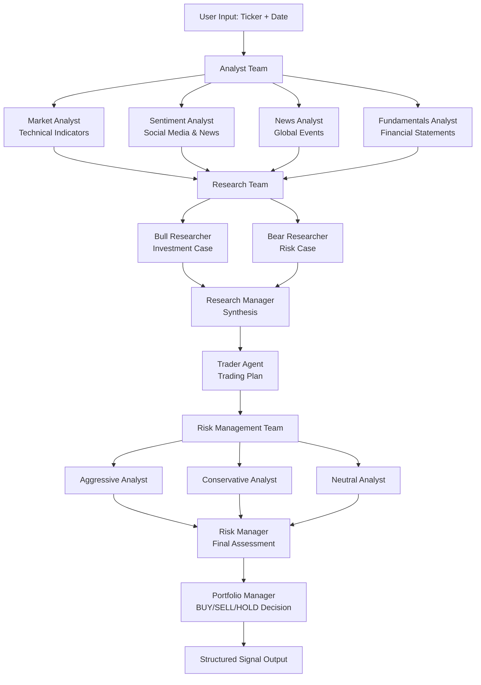

<div align="center">

# 🚀 Chanana Quant

### AI-Native Hedge Fund Architecture for Indian Markets

[](https://www.python.org/downloads/)
[](https://github.com/langchain-ai/langgraph)
[](LICENSE)

**A sophisticated multi-agent LLM system that simulates a real-world trading firm**

[Features](#-key-features) • [Architecture](#-system-architecture) • [Installation](#-installation) • [Usage](#-usage) • [Documentation](#-documentation)

</div>

---

## 🎯 What is Chanana Quant?

Chanana Quant is a production-grade, multi-agent trading research framework that orchestrates specialized AI agents to analyze markets, debate investment strategies, manage risk, and make autonomous trading decisions. Built on LangGraph, it decomposes complex trading workflows into specialized roles, mirroring the structure of a professional trading firm.

### 🌟 Key Features

<table>
<tr>
<td width="50%">

**🤖 Multi-Agent Architecture**
- Specialized analyst teams (Technical, Fundamental, Sentiment, News)
- Bull/Bear research debate system
- Risk management committee
- Portfolio manager oversight

**🧠 Advanced AI Integration**
- Support for multiple LLM providers (OpenAI, Anthropic, Google, xAI, Ollama)
- Configurable reasoning models for complex analysis
- Memory system with BM25-based retrieval
- Structured signal extraction

</td>
<td width="50%">

**📊 Indian Market Specialization**
- NSE/BSE ticker support
- NIFTY50 and sectoral indices integration
- India VIX volatility tracking
- FII/DII flow analysis
- Market hours and holiday calendar

**🔬 Research & Backtesting**
- Historical simulation engine
- Performance metrics (Sharpe, CAGR, drawdown)
- Experiment tracking and comparison
- Property-based testing framework

</td>
</tr>
</table>

> **⚠️ Disclaimer:** Chanana Quant is designed for research and educational purposes. Trading performance varies based on model selection, configuration, data quality, and market conditions. This is not financial advice.

---

## 🏗️ System Architecture

Chanana Quant orchestrates a sophisticated pipeline of specialized agents, each with distinct responsibilities:

### 📈 Execution Pipeline



<p align="center">
  
</p>

### 🔍 Agent Teams

<details>
<summary><b>📊 Analyst Team</b> - Data Collection & Analysis</summary>

<p align="center">
  
</p>

- **Market Analyst**: Technical indicators (MACD, RSI, Bollinger Bands, ATR, VWMA)
- **Sentiment Analyst**: Social media and news sentiment scoring
- **News Analyst**: Global news, insider transactions, macroeconomic events
- **Fundamentals Analyst**: Financial statements, balance sheets, cash flow analysis
- **Macro Analyst** *(optional)*: Market regime, sector rotation, India VIX

Each analyst generates domain-specific reports using specialized data tools and LLM reasoning.

</details>

<details>
<summary><b>🎯 Research Team</b> - Investment Debate & Synthesis</summary>

<p align="center">
  
</p>

- **Bull Researcher**: Argues for investment, identifies opportunities
- **Bear Researcher**: Argues against investment, highlights risks
- **Research Manager**: Synthesizes debate into balanced investment plan

The research team engages in multi-round debates, using memory to learn from past decisions.

</details>

<details>
<summary><b>💼 Trader Agent</b> - Trading Decision</summary>

<p align="center">
  
</p>

- Receives investment plan from research team
- Creates detailed trading plan with position sizing
- Uses memory to avoid repeating past mistakes
- Outputs structured signals with confidence scores

</details>

<details>
<summary><b>⚖️ Risk Management Team</b> - Risk Assessment</summary>

<p align="center">
  
</p>

- **Aggressive Analyst**: High-risk, high-reward perspective
- **Conservative Analyst**: Risk-averse, capital preservation focus
- **Neutral Analyst**: Balanced, data-driven approach
- **Risk Manager**: Synthesizes debate into final risk assessment

The risk team evaluates portfolio impact, volatility, and market conditions.

</details>

<details>
<summary><b>🎓 Portfolio Manager</b> - Final Decision Authority</summary>

- Reviews all analysis and risk assessments
- Approves or rejects trading proposals
- Outputs final decision: **BUY** / **SELL** / **HOLD**
- Includes position sizing, stop loss, and take profit levels

</details>

---

## 🚀 Installation

### Prerequisites

- Python 3.13+
- Virtual environment manager (conda, venv, etc.)
- API keys for LLM providers and data sources

### Quick Start

1. **Clone the repository**
```bash
git clone https://github.com/maximally0/chanana-quant.git
cd chanana-quant
```

2. **Create virtual environment**
```bash
# Using conda
conda create -n chanana_quant python=3.13
conda activate chanana_quant

# Or using venv
python -m venv venv
source venv/bin/activate  # On Windows: venv\Scripts\activate
```

3. **Install dependencies**
```bash
pip install -r requirements.txt
```

4. **Configure API keys**

Create a `.env` file from the template:
```bash
cp .env.example .env
```

Edit `.env` and add your API keys:
```bash
# LLM Providers (choose one or more)
OPENAI_API_KEY=sk-...
GOOGLE_API_KEY=...
ANTHROPIC_API_KEY=...
XAI_API_KEY=...
OPENROUTER_API_KEY=...

# Data Sources
ALPHA_VANTAGE_API_KEY=...  # Optional, yfinance works without API key
```

### Supported LLM Providers

| Provider | Models | Configuration |
|----------|--------|---------------|
| **OpenAI** | GPT-4, GPT-5, o1, o3 | `llm_provider: "openai"` |
| **Anthropic** | Claude 3.5, Claude 4 | `llm_provider: "anthropic"` |
| **Google** | Gemini 2.0, Gemini 2.5 | `llm_provider: "google"` |
| **xAI** | Grok | `llm_provider: "xai"` |
| **OpenRouter** | Multiple models | `llm_provider: "openrouter"` |
| **Ollama** | Local models | `llm_provider: "ollama"` |

---

## 💻 Usage

### Interactive CLI

Launch the interactive command-line interface:

```bash
python -m cli.main
```

The CLI guides you through:
- Ticker selection (NSE/BSE stocks)
- Analysis date
- LLM provider and model selection
- Analyst team configuration
- Research depth settings

The interface displays real-time progress as agents analyze the market, showing each analyst's reports, research debates, risk assessments, and the final trading decision with structured signal output.

### Python API

#### Basic Usage

```python
from chanana_quant.graph.trading_graph import ChananaQuantGraph
from chanana_quant.default_config import DEFAULT_CONFIG

# Initialize with default configuration
graph = ChananaQuantGraph(debug=True, config=DEFAULT_CONFIG.copy())

# Analyze a stock
final_state, decision = graph.propagate("RELIANCE.NS", "2026-01-15")

print(f"Decision: {decision['text']}")
print(f"Confidence: {decision['structured'].confidence}")
```

#### Custom Configuration

```python
from chanana_quant.graph.trading_graph import ChananaQuantGraph
from chanana_quant.default_config import DEFAULT_CONFIG

# Create custom configuration
config = DEFAULT_CONFIG.copy()
config.update({
    "llm_provider": "anthropic",
    "deep_think_llm": "claude-4-opus",      # Complex reasoning
    "quick_think_llm": "claude-4-sonnet",   # Quick tasks
    "max_debate_rounds": 3,                  # More thorough debate
    "max_risk_discuss_rounds": 2,
    
    # Configure data sources
    "data_vendors": {
        "core_stock_apis": "yfinance",
        "technical_indicators": "yfinance",
        "fundamental_data": "alpha_vantage",  # Use Alpha Vantage for fundamentals
        "news_data": "yfinance",
    }
})

# Initialize with custom config
graph = ChananaQuantGraph(
    selected_analysts=["market", "fundamentals", "news", "macro"],
    debug=True,
    config=config
)

# Run analysis
final_state, decision = graph.propagate("TCS.NS", "2026-03-04")
```

#### Structured Signal Output

```python
# Access structured signal data
signal = decision['structured']

print(f"Action: {signal.action}")                    # BUY/SELL/HOLD
print(f"Confidence: {signal.confidence:.2%}")        # 0.0 - 1.0
print(f"Position Size: {signal.position_size_pct}%") # % of portfolio
print(f"Stop Loss: {signal.stop_loss_pct}%")         # Risk management
print(f"Take Profit: {signal.take_profit_pct}%")     # Target
print(f"Holding Period: {signal.holding_period_days} days")

# Reasoning
print(f"\nPrimary Reason: {signal.primary_reason}")
print(f"Supporting Factors: {signal.supporting_factors}")
print(f"Risk Factors: {signal.risk_factors}")
```

#### Backtesting

```python
from chanana_quant.backtesting.engine import BacktestEngine

# Create backtesting engine
engine = BacktestEngine(graph, initial_capital=100000)

# Run backtest
results = engine.run(
    ticker="INFY.NS",
    start_date="2025-01-01",
    end_date="2026-01-01",
    rebalance_frequency="weekly"
)

# View performance metrics
metrics = results['metrics']
print(f"Total Return: {metrics['total_return']:.2%}")
print(f"CAGR: {metrics['cagr']:.2%}")
print(f"Sharpe Ratio: {metrics['sharpe_ratio']:.2f}")
print(f"Max Drawdown: {metrics['max_drawdown']:.2%}")
print(f"Win Rate: {metrics['win_rate']:.2%}")
```

#### Memory & Reflection

```python
# After a trade closes, reflect on the outcome
position_return = 15.5  # 15.5% return

# Update agent memories with lessons learned
graph.reflect_and_remember(position_return)

# Memories are automatically used in future analyses
# Agents learn from past successes and mistakes
```

---

## 📚 Documentation

### Configuration Options

All configuration options are defined in `chanana_quant/default_config.py`:

```python
DEFAULT_CONFIG = {
    # LLM Settings
    "llm_provider": "openai",              # Provider selection
    "deep_think_llm": "gpt-5.2",          # Complex reasoning model
    "quick_think_llm": "gpt-5-mini",      # Quick tasks model
    "backend_url": "https://api.openai.com/v1",
    
    # Provider-specific settings
    "google_thinking_level": None,         # "high", "minimal", etc.
    "openai_reasoning_effort": None,       # "medium", "high", "low"
    
    # Debate settings
    "max_debate_rounds": 1,                # Research debate rounds
    "max_risk_discuss_rounds": 1,          # Risk debate rounds
    "max_recur_limit": 100,                # Graph recursion limit
    
    # Data vendors
    "data_vendors": {
        "core_stock_apis": "yfinance",
        "technical_indicators": "yfinance",
        "fundamental_data": "yfinance",
        "news_data": "yfinance",
    },
    
    # Tool-level overrides (optional)
    "tool_vendors": {
        # "get_stock_data": "alpha_vantage",  # Override specific tools
    },
    
    # Directories
    "results_dir": "./results",
    "data_cache_dir": "./chanana_quant/dataflows/data_cache",
}
```

### Indian Market Features

#### NSE/BSE Ticker Format

```python
# Automatic ticker normalization
"RELIANCE"    → "RELIANCE.NS"  # NSE
"TCS"         → "TCS.NS"       # NSE
"INFY"        → "INFY.NS"      # NSE
"HDFCBANK.BO" → "HDFCBANK.BO"  # BSE (explicit)
```

#### Macro Context Integration

When macro analyst is enabled, agents receive:
- NIFTY50 trend and momentum
- Sectoral index performance
- India VIX volatility regime
- FII/DII flow sentiment
- Stock vs. index relative strength

#### Market Hours & Holidays

The system respects Indian market hours (9:15 AM - 3:30 PM IST) and holiday calendar for backtesting and validation.

### Data Sources

| Category | Default | Alternative | API Key Required |
|----------|---------|-------------|------------------|
| Stock Prices | yfinance | Alpha Vantage | No / Yes |
| Technical Indicators | yfinance | Alpha Vantage | No / Yes |
| Fundamentals | yfinance | Alpha Vantage | No / Yes |
| News | yfinance | Alpha Vantage | No / Yes |

### Agent Selection

Choose which analysts to include:

```python
graph = ChananaQuantGraph(
    selected_analysts=[
        "market",        # Technical analysis
        "fundamentals",  # Financial statements
        "news",          # News & events
        "social",        # Sentiment analysis
        "macro"          # Market regime (optional)
    ],
    config=config
)
```

---

## 🔬 Advanced Features

### Experiment Tracking

Track and compare different configurations:

```python
from chanana_quant.experiments.tracker import ExperimentTracker
from chanana_quant.experiments.config import ExperimentConfig

# Create experiment
tracker = ExperimentTracker()
exp_config = ExperimentConfig(
    experiment_id=ExperimentConfig.generate_id(),
    name="GPT-5 vs Claude-4 Comparison",
    description="Compare reasoning models",
    llm_provider="openai",
    deep_think_llm="gpt-5.2",
    # ... other config
)

exp_id = tracker.create_experiment(exp_config)

# Run analysis with experiment tracking
graph = ChananaQuantGraph(config=config, experiment_id=exp_id)
final_state, decision = graph.propagate("RELIANCE.NS", "2026-01-15")

# Compare experiments
from chanana_quant.experiments.comparison import ExperimentComparison
comparison = ExperimentComparison(tracker)
report = comparison.generate_comparison_report([exp_id1, exp_id2, exp_id3])
```

### Portfolio Management

Manage multiple positions:

```python
from chanana_quant.portfolio.manager import PortfolioManager

# Create portfolio manager
portfolio = PortfolioManager(
    initial_capital=100000,
    max_position_size=0.20,  # Max 20% per position
    max_sector_exposure=0.40  # Max 40% per sector
)

# Analyze multiple stocks
tickers = ["RELIANCE.NS", "TCS.NS", "INFY.NS", "HDFCBANK.NS"]
for ticker in tickers:
    _, decision = graph.propagate(ticker, "2026-03-04")
    portfolio.process_signal(decision['structured'])

# Get portfolio allocation
allocation = portfolio.get_allocation()
```

### Custom Analysts

Extend the system with custom analysts:

```python
from chanana_quant.agents.utils.agent_utils import create_agent_with_tools

def create_custom_analyst(llm, tools):
    """Create a custom analyst agent."""
    
    prompt = """You are a Custom Analyst specializing in...
    
    Your task is to analyze {company_of_interest} on {trade_date}.
    
    Use the available tools to gather data and provide insights.
    """
    
    return create_agent_with_tools(llm, tools, prompt)

# Register custom analyst
# (See documentation for full integration guide)
```

---

## 🎯 Use Cases

### Research & Analysis
- **Systematic Strategy Development**: Test trading hypotheses with AI-powered analysis
- **Market Regime Detection**: Identify bull/bear/sideways markets automatically
- **Sector Rotation**: Track sectoral momentum and rotation signals
- **Risk Assessment**: Multi-perspective risk evaluation

### Education & Learning
- **Trading Psychology**: Understand bull/bear debate dynamics
- **Risk Management**: Learn portfolio risk assessment frameworks
- **Technical Analysis**: Study indicator combinations and patterns
- **Fundamental Analysis**: Explore financial statement analysis

### Backtesting & Optimization
- **Strategy Validation**: Test agent decisions on historical data
- **Parameter Optimization**: Find optimal debate rounds, analyst combinations
- **Model Comparison**: Compare different LLM providers and models
- **Performance Attribution**: Understand what drives returns

---

## 🛠️ Project Structure

```
chanana-quant/
├── chanana_quant/
│   ├── agents/              # Agent implementations
│   │   ├── analysts/        # Data analysis agents
│   │   ├── researchers/     # Bull/bear researchers
│   │   ├── managers/        # Research & risk managers
│   │   ├── trader/          # Trading decision agent
│   │   ├── risk_mgmt/       # Risk assessment agents
│   │   └── utils/           # Agent utilities, tools, memory
│   ├── dataflows/           # Data acquisition layer
│   │   ├── y_finance.py     # Yahoo Finance integration
│   │   ├── alpha_vantage*.py # Alpha Vantage integration
│   │   └── interface.py     # Vendor routing
│   ├── graph/               # LangGraph orchestration
│   │   ├── trading_graph.py # Main graph class
│   │   ├── setup.py         # Graph construction
│   │   ├── conditional_logic.py # Flow control
│   │   └── signal_processing.py # Signal extraction
│   ├── llm_clients/         # LLM provider abstraction
│   ├── backtesting/         # Backtesting engine
│   ├── experiments/         # Experiment tracking
│   ├── portfolio/           # Portfolio management
│   └── default_config.py    # System configuration
├── cli/                     # Command-line interface
│   ├── main.py             # Interactive CLI
│   └── utils.py            # CLI utilities
├── assets/                  # Documentation images
├── main.py                  # Python API example
├── requirements.txt         # Dependencies
└── README.md               # This file
```

---

## 🤝 Contributing

We welcome contributions! Whether it's:
- 🐛 Bug fixes
- ✨ New features
- 📝 Documentation improvements
- 🧪 Test coverage
- 💡 Ideas and suggestions

Please feel free to open issues or submit pull requests.

### Development Setup

```bash
# Clone and install in development mode
git clone https://github.com/maximally0/chanana-quant.git
cd chanana-quant
pip install -e .

# Run tests (if available)
pytest tests/
```

---

## 📄 License

This project is open source. See [LICENSE](LICENSE) file for details.

---

## 🙏 Acknowledgments

Built with:
- [LangGraph](https://github.com/langchain-ai/langgraph) - Agent orchestration framework
- [LangChain](https://github.com/langchain-ai/langchain) - LLM application framework
- [yfinance](https://github.com/ranaroussi/yfinance) - Market data
- [Alpha Vantage](https://www.alphavantage.co/) - Financial data API
- [Rich](https://github.com/Textualize/rich) - Terminal UI

---

## 📞 Support

- **Issues**: [GitHub Issues](https://github.com/maximally0/chanana-quant/issues)
- **Discussions**: [GitHub Discussions](https://github.com/maximally0/chanana-quant/discussions)
- **Documentation**: [Wiki](https://github.com/maximally0/chanana-quant/wiki)

---

<div align="center">

**⭐ Star this repo if you find it useful!**

Made with ❤️ for the trading and AI community

</div>
